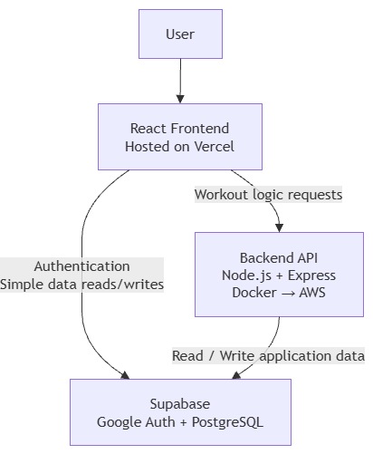

# ARCH.md — Architecture

> **This is how your app is built** — the decisions behind the code.
> You write this _after_ `SPEC.md` and _before_ serious building. It's yours to design; there is no single right answer.
> Keep it current: if the build drifts from this doc, fix the doc.

---

## 1. Big picture

The React front end, hosted on Vercel, provides the user interface and handles user interactions. Supabase provides Google authentication and the PostgreSQL database for storing user profiles, workout plans, workout records, exercises, and progress data. The Node.js + Express backend API handles trusted fitness logic such as generating personalized workout plans and adapting future workouts based on the user's actual performance. The backend runs in Docker during development and will be deployed to AWS, while the frontend communicates with both Supabase and the backend API as needed.

## 2. Architecture diagram



## 3. Components

| Component   | Responsibility                                                                                                               | Tech              | Runs on        |
| ----------- | ---------------------------------------------------------------------------------------------------------------------------- | ----------------- | -------------- |
| Front end   | Public landing page, user interface, displaying workout plans, recording performance, showing progress and exercise guidance | React             | Vercel         |
| Auth        | Google/Gmail sign-in and user authentication                                                                                 | Supabase Auth     | Supabase cloud |
| Database    | Store user profiles, workout plans, workout records, exercises and progress data                                             | Supabase Postgres | Supabase cloud |
| Backend API | Generate workout plans, evaluate actual performance, adapt future workouts and provide trusted fitness logic                 | Node.js + Express | Docker → AWS   |

## 4. Data model

The application uses six PostgreSQL tables. The 12 initial workout templates are static backend configuration, organized by fitness goal and experience level; they are not stored as user database tables. When a user creates a plan, the backend uses the matching template to generate the user's `workout_plan` and `plan_exercises` records.

### Table: `users`

| Column             | Type        | Notes                                                           |
| ------------------ | ----------- | --------------------------------------------------------------- |
| `id`               | uuid        | Primary key; linked to Supabase Auth user                       |
| `name`             | text        | User's name                                                     |
| `age`              | int         | User's age                                                      |
| `height_cm`        | numeric     | Height in centimeters                                           |
| `weight_kg`        | numeric     | Current weight in kilograms                                     |
| `experience_level` | text        | `beginner`, `intermediate`, or `advanced`                       |
| `fitness_goal`     | text        | `weight_loss`, `muscle_gain`, `general_fitness`, or `endurance` |
| `created_at`       | timestamptz | Profile creation time                                           |
| `updated_at`       | timestamptz | Last profile update                                             |

**Ownership:** The authenticated user owns their own profile row.

### Table: `weight_history`

| Column        | Type        | Notes                           |
| ------------- | ----------- | ------------------------------- |
| `id`          | uuid        | Primary key                     |
| `user_id`     | uuid        | Foreign key → `users.id`; owner |
| `weight_kg`   | numeric     | Recorded weight in kilograms    |
| `recorded_at` | timestamptz | When the weight was recorded    |

**Ownership:** Each weight record belongs to the authenticated user. The user's current weight in `users.weight_kg` is also updated to the latest entry.

### Table: `workout_plans`

| Column            | Type        | Notes                                        |
| ----------------- | ----------- | -------------------------------------------- |
| `id`              | uuid        | Primary key                                  |
| `user_id`         | uuid        | Foreign key → `users.id`; owner              |
| `week_start_date` | date        | First day of the planned week                |
| `week_end_date`   | date        | Last day of the planned week                 |
| `template_goal`   | text        | Goal used to select the template             |
| `template_level`  | text        | Experience level used to select the template |
| `created_at`      | timestamptz | Plan creation time                           |

**Ownership:** Each plan belongs to one authenticated user.

### Table: `exercises`

| Column         | Type | Notes                                      |
| -------------- | ---- | ------------------------------------------ |
| `id`           | uuid | Primary key                                |
| `name`         | text | Exercise name                              |
| `category`     | text | `strength`, `cardio`, or `flexibility`     |
| `muscle_group` | text | Primary muscle group or relevant body area |
| `instructions` | text | Manually written exercise instructions     |
| `youtube_url`  | text | Curated public YouTube demonstration URL   |

**Ownership:** Exercise records are shared seed-library data, not owned by individual users.

### Table: `plan_exercises`

| Column                        | Type    | Notes                                                           |
| ----------------------------- | ------- | --------------------------------------------------------------- |
| `id`                          | uuid    | Primary key                                                     |
| `workout_plan_id`             | uuid    | Foreign key → `workout_plans.id`                                |
| `exercise_id`                 | uuid    | Foreign key → `exercises.id`                                    |
| `scheduled_date`              | date    | Date the exercise is scheduled                                  |
| `exercise_order`              | int     | Display/order within the workout                                |
| `target_sets`                 | int     | Current prescribed sets (may be adapted week over week)         |
| `target_reps`                 | int     | Current prescribed reps (may be adapted week over week)         |
| `target_weight_kg`            | numeric | Current prescribed weight (may be adapted week over week)       |
| `target_duration_min`         | numeric | Current prescribed duration (may be adapted week over week)     |
| `target_distance_km`          | numeric | Current prescribed distance (may be adapted week over week)     |
| `initial_target_sets`         | int     | Original sets from the first generated plan (guardrail ref)     |
| `initial_target_reps`         | int     | Original reps from the first generated plan (guardrail ref)     |
| `initial_target_weight_kg`    | numeric | Original weight from the first generated plan (guardrail ref)   |
| `initial_target_duration_min` | numeric | Original duration from the first generated plan (guardrail ref) |
| `initial_target_distance_km`  | numeric | Original distance from the first generated plan (guardrail ref) |

**Ownership:** A plan exercise belongs to the user through its `workout_plan_id`.

### Table: `workout_logs`

| Column                | Type        | Notes                             |
| --------------------- | ----------- | --------------------------------- |
| `id`                  | uuid        | Primary key                       |
| `user_id`             | uuid        | Foreign key → `users.id`; owner   |
| `plan_exercise_id`    | uuid        | Foreign key → `plan_exercises.id` |
| `performed_at`        | timestamptz | When the exercise was performed   |
| `actual_sets`         | int         | Actual completed sets             |
| `actual_reps`         | int         | Actual completed repetitions      |
| `actual_weight_kg`    | numeric     | Actual weight used                |
| `actual_duration_min` | numeric     | Actual cardio duration            |
| `actual_distance_km`  | numeric     | Actual cardio distance            |
| `notes`               | text        | Optional user notes               |

**Ownership:** Each workout log belongs to the authenticated user.

### Relationships

- One user has one current workout plan in V1.
- One user has many `weight_history` entries (one per weigh-in).
- One workout plan contains many `plan_exercises`.
- One exercise can appear in many workout plans through `plan_exercises`.
- Therefore, `workout_plans` and `exercises` have a many-to-many relationship through `plan_exercises`.
- One `plan_exercise` can have multiple `workout_logs` if the user records multiple performance entries.
- Each workout log belongs to one user and references the planned exercise it records.
- The 12 initial workout templates are static backend configuration and generate the database records for each user's plans.

### Computed values (not stored)

- **Weekly completion rate** — calculated from `workout_logs` actual values vs. `plan_exercises` target values for a given week's plan.
- **Streak** — consecutive weeks (ending at the current week) where the user has ≥ 1 `workout_log` entry. Computed at query time by the `GET /progress/summary` endpoint.
- **Weight trend** — derived from `weight_history` entries ordered by `recorded_at`. The starting weight is the earliest entry.

### Data flow

```text
Static 12 Templates
        |
        | matching fitness_goal + experience_level
        v
   Workout Plan
        |
        v
   Plan Exercises
        |
        | user performs exercise
        v
   Workout Logs
        |
        v
Progress calculations
        |
        v
Next week's adapted Workout Plan
```

## 5. Access rules (security)

- **User profile:** A signed-in user can read and update only their own `users` row.
- **Weight history:** A signed-in user can create and read only their own `weight_history` entries.
- **Workout plans:** A signed-in user can read only workout plans where `user_id` matches their authenticated user ID. Users cannot read or modify another user's plans.
- **Plan exercises:** A signed-in user can read only plan exercises belonging to their own workout plan. Users cannot access plan exercises belonging to another user.
- **Exercise library:** Exercise records are shared read-only seed data. Signed-in users can read exercise information but cannot modify the exercise library.
- **Workout logs:** A signed-in user can create, read, update, and delete only their own workout logs.
- **Backend operations:** The backend authenticates requests using the user's Supabase authentication token and performs workout-generation and adaptation logic for the authenticated user.
- **Signed-out visitors:** Signed-out users can view the public landing page but cannot access profiles, workout plans, plan exercises, workout logs, weight history, or progress data.

Supabase Row-Level Security (RLS) will enforce these ownership rules when the database is implemented.

## 6. API contract

The backend API is responsible for trusted workout-planning, adaptation, and progress logic. The authenticated user's identity is extracted server-side from the Supabase authentication JWT token (`Authorization: Bearer <token>`) rather than trusted from a user ID supplied by the client.

### Server vs. Client Responsibilities

| Responsibility | Location | Rationale |
|---|---|---|
| **Workout Streak Calculation** | **Server** | Prevents client-side manipulation, avoids downloading months of raw workout logs over the wire, and guarantees a single trusted source of truth across web/mobile/dashboards. |
| **Weekly Completion Rate** | **Server** | Volume calculations (prescribed vs. actual sets, reps, distance, duration) are computed authoritatively on the server. Used by both the Progress UI and the Adaptation Engine. |
| **Plan Generation & Guardrail Reference** | **Server** | Matches the 12 static templates, calculates calendar date boundaries, and persists the immutable baseline (`initial_target_*`) required for safe long-term progression. |
| **Workout Adaptation Heuristic** | **Server** | Evaluates completion rate thresholds (≥90%, 60–89%, 30–59%, <30%), enforces 0.5×–1.5× initial guardrails, checks consecutive missed week nudges, and can run via cron triggers. |
| **Weight Trend Aggregation** | **Server** | Aggregates weigh-ins into starting weight, current weight, delta, and ordered data points for chart rendering. |
| **UI State, Forms & Optimistic Updates** | **Client** | Profile forms, logging exercise inputs, day-to-day navigation, YouTube video playback, and responsive rendering. |

---

### Core v1 Endpoints

The backend framework is **Node.js + Express** (`express: ^5.2.x`). All endpoints (except `/health`) require the `Authorization: Bearer <supabase_access_token>` header.

| Method | Path | Auth Required | Purpose |
|---|---|---|---|
| `GET` | `/health` | No | Container health check for Docker / AWS App Runner |
| `GET` | `/summary/week` | Optional/Yes | Returns current week summary snapshot (completion rate, streak, planned vs. completed) |
| `POST` | `/plans/generate` | Yes | Generate initial 7-day workout plan from profile & goal |
| `POST` | `/plans/adapt` | Yes | Evaluate performance, apply ±10% heuristic & guardrails, generate next week's plan |
| `GET` | `/progress/summary` | Yes | Return trusted streak, weekly completion history, and weight trend |

---

#### 1. `GET /health`
- **Purpose:** Liveness and readiness probe for container orchestrators.
- **Request:** None.
- **Response (`200 OK`):**
  ```json
  {
    "status": "ok",
    "timestamp": "2026-09-05T10:00:00.000Z"
  }
  ```

---

#### 2. `GET /summary/week`
- **Purpose:** Returns a trusted summary snapshot for the current week (completion rate, active streak, and exercise counts).
- **Headers:** Optional/Bearer token.
- **Response (`200 OK`):**
  ```json
  {
    "status": "placeholder",
    "message": "Weekly summary endpoint. Will compute trusted weekly volume, streak, and completion rate.",
    "data": {
      "week_start_date": "2026-09-07",
      "week_end_date": "2026-09-13",
      "completion_rate": 0,
      "streak_weeks": 0,
      "total_planned_exercises": 0,
      "total_completed_exercises": 0
    }
  }
  ```

---

#### 3. `POST /plans/generate`
- **Purpose:** Creates a 7-day personalized workout plan from the user's fitness goal and experience level, storing initial baseline targets for future guardrails.
- **Headers:** `Authorization: Bearer <token>`, `Content-Type: application/json`
- **Request Body (optional if profile already in DB):**
  ```json
  {
    "fitness_goal": "weight_loss",
    "experience_level": "beginner"
  }
  ```
- **Response (`201 Created`):**
  ```json
  {
    "plan": {
      "id": "b3e21820-2ef8-4d5d-a169-76ff005698b3",
      "user_id": "c1f7289b-7341-477d-b541-d8ec77598c11",
      "week_start_date": "2026-09-07",
      "week_end_date": "2026-09-13",
      "template_goal": "weight_loss",
      "template_level": "beginner",
      "created_at": "2026-09-05T10:00:00.000Z"
    },
    "plan_exercises": [
      {
        "id": "e8a94b50-9c12-4eb4-b912-32a033f7c321",
        "workout_plan_id": "b3e21820-2ef8-4d5d-a169-76ff005698b3",
        "exercise_id": "a0000000-0000-0000-0000-000000000002",
        "scheduled_date": "2026-09-07",
        "exercise_order": 1,
        "target_sets": 3,
        "target_reps": 10,
        "target_weight_kg": 45,
        "target_duration_min": null,
        "target_distance_km": null,
        "initial_target_sets": 3,
        "initial_target_reps": 10,
        "initial_target_weight_kg": 45,
        "initial_target_duration_min": null,
        "initial_target_distance_km": null,
        "exercise": {
          "id": "a0000000-0000-0000-0000-000000000002",
          "name": "Bench Press",
          "category": "strength",
          "muscle_group": "Chest",
          "instructions": "Lie flat on the bench, grip the barbell slightly wider than shoulder-width, lower the bar smoothly to mid-chest, and press back up to starting position.",
          "youtube_url": "https://www.youtube.com/watch?v=rT7DgCr-3pg"
        }
      }
    ]
  }
  ```

---

#### 3. `POST /plans/adapt`
- **Purpose:** Server reads current week's plan exercises and actual `workout_logs`, computes completion rate, applies the SPEC §5a adaptation rules (±10%, 0.5×–1.5× guardrails), and produces next week's schedule.
- **Headers:** `Authorization: Bearer <token>`
- **Request Body:** None (server loads the active plan and current week's logs for the authenticated user).
- **Response (`200 OK`):**
  ```json
  {
    "workout_plan": {
      "id": "9cb44321-4f11-45de-910a-471ba98031e4",
      "user_id": "c1f7289b-7341-477d-b541-d8ec77598c11",
      "week_start_date": "2026-09-14",
      "week_end_date": "2026-09-20",
      "template_goal": "weight_loss",
      "template_level": "beginner",
      "created_at": "2026-09-13T23:00:00.000Z"
    },
    "plan_exercises": [
      {
        "id": "fa1290bb-8f31-419b-a01f-0b31e976da31",
        "workout_plan_id": "9cb44321-4f11-45de-910a-471ba98031e4",
        "exercise_id": "a0000000-0000-0000-0000-000000000002",
        "scheduled_date": "2026-09-14",
        "exercise_order": 1,
        "target_sets": 3,
        "target_reps": 11,
        "target_weight_kg": 50,
        "target_duration_min": null,
        "target_distance_km": null,
        "initial_target_sets": 3,
        "initial_target_reps": 10,
        "initial_target_weight_kg": 45,
        "initial_target_duration_min": null,
        "initial_target_distance_km": null
      }
    ],
    "completion_rate": 92,
    "nudge": null,
    "message": "Targets increased 10% — great week!"
  }
  ```

---

#### 4. `GET /progress/summary`
- **Purpose:** Delivers authoritative progress metrics computed across past plans and logs, directly powering dashboard cards and progress charts without bulky client computations.
- **Headers:** `Authorization: Bearer <token>`
- **Request Body:** None.
- **Response (`200 OK`):**
  ```json
  {
    "streak": {
      "current_weeks": 4,
      "best_weeks": 6,
      "last_logged_date": "2026-09-04"
    },
    "current_week": {
      "completion_rate": 75,
      "total_planned": 12,
      "total_completed": 9
    },
    "weekly_history": [
      { "week": "W1", "start_date": "2026-08-10", "rate": 85 },
      { "week": "W2", "start_date": "2026-08-17", "rate": 92 },
      { "week": "W3", "start_date": "2026-08-24", "rate": 78 },
      { "week": "W4", "start_date": "2026-08-31", "rate": 65 },
      { "week": "W5", "start_date": "2026-09-07", "rate": 75 }
    ],
    "weight_summary": {
      "starting_weight_kg": 78.5,
      "current_weight_kg": 76.2,
      "net_change_kg": -2.3,
      "history": [
        { "recorded_at": "2026-08-10T08:00:00Z", "weight_kg": 78.5 },
        { "recorded_at": "2026-08-17T08:00:00Z", "weight_kg": 77.8 },
        { "recorded_at": "2026-08-24T08:00:00Z", "weight_kg": 77.1 },
        { "recorded_at": "2026-08-31T08:00:00Z", "weight_kg": 76.6 },
        { "recorded_at": "2026-09-04T08:00:00Z", "weight_kg": 76.2 }
      ]
    }
  }
  ```

---

### Adaptation logic (`POST /plans/adapt`)

The endpoint calculates the authenticated user's weekly completion rate (percentage of prescribed volume completed) and applies the following heuristic (SPEC §5a):

| Completion Rate            | Action                              |
| -------------------------- | ----------------------------------- |
| ≥ 90%                      | Increase next week's targets by 10% |
| 60–89%                     | Keep targets the same               |
| 30–59%                     | Decrease next week's targets by 10% |
| < 30% or 0 logged workouts | Keep current targets                |

**Guardrails:**

- Targets never exceed **1.5×** the initial plan values (stored in `plan_exercises.initial_target_*` columns).
- Targets never fall below **0.5×** the initial plan values.
- If the user has had < 30% completion for **3 consecutive weeks**, the response includes a prompt to review their goal or profile.

**Response fields:**

- `workout_plan` — the generated plan for the next week.
- `plan_exercises` — the list of exercises with adapted targets.
- `nudge` — `null`, `"encouragement"` (completion < 30%), or `"review_goal"` (3 consecutive weeks below 30%).
- `message` — human-readable explanation when targets change (e.g. "Targets increased 10% — great week!") or `null`.

### Scheduled adaptation trigger

Adaptation runs automatically every **Sunday at 23:00 UTC** via a backend cron job (`node-cron` or equivalent scheduler). The cron iterates over all users with an active workout plan and invokes the same adaptation logic as the manual endpoint. Users can also trigger adaptation on demand via `POST /plans/adapt`.

### Input validation

Profile data submitted during onboarding is validated on both the frontend (immediate user feedback) and the backend (authoritative check):

- `name` — non-empty string
- `age` — positive integer
- `height_cm` — positive number (> 0)
- `weight_kg` — positive number (> 0)
- `experience_level` — one of `beginner`, `intermediate`, `advanced`
- `fitness_goal` — one of `weight_loss`, `muscle_gain`, `general_fitness`, `endurance`

Invalid input returns HTTP `400` with field-level error messages. Database `CHECK` constraints provide a final safety net.

## 7. Secrets & configuration

The project uses a unified configuration standard detailed authoritatively in [`docs/CONFIG_AND_SECRETS.md`](./CONFIG_AND_SECRETS.md).

- **Front end environment variables (`VITE_*`):**
  - `VITE_SUPABASE_URL`: Supabase project API gateway URL.
  - `VITE_SUPABASE_ANON_KEY`: Browser-safe anon/publishable key (enforced by RLS).
  - `VITE_API_URL`: Backend API base URL.
  - *Strict Rule:* Any variable prefixed with `VITE_` is public and bundled into client assets. Never put private keys here.

- **Backend environment variables (unprefixed, server-side only):**
  - `PORT`: HTTP port Express listens on (default: `8000`).
  - `NODE_ENV`: Runtime environment (`development`, `production`, `test`).
  - `SUPABASE_URL`: Supabase project URL for server queries.
  - `SUPABASE_SERVICE_ROLE_KEY`: Admin secret key that bypasses RLS (CRITICAL SECRET).
  - `CORS_ORIGIN`: Allowed origins for API requests (`*` in dev, Vercel domain in prod).
  - `AI_API_KEY`: Optional LLM API key for coaching insights.

- **Local development:** Handled via `.env` (monorepo root), `backend/.env`, and `frontend/.env.local`. All `.env*` files are strictly excluded from Git.
- **Cloud deployment:** Frontend configuration is managed in **Vercel Project Environment Variables**. Backend secrets are stored securely in **AWS Secrets Manager** or **AWS Systems Manager (SSM) Parameter Store** and injected into AWS App Runner / ECS container runtime via IAM task execution roles.
- **Repo hygiene:** Git history audit verified zero committed secrets. Clean sweep maintained via pre-commit and automated checks.

---

## 8. Deployment plan

| Piece       | Local (early)               | Cloud (final)                               |
| ----------- | --------------------------- | ------------------------------------------- |
| Front end   | Vite dev server (`:5173`)   | Vercel                                      |
| Data & auth | Supabase cloud              | Supabase cloud                              |
| Backend     | Node.js + Express in Docker | Docker image in Amazon ECR → AWS App Runner |

The frontend is developed and tested locally before being deployed to Vercel. Supabase provides the cloud database and authentication throughout development and production. The backend is containerized with Docker locally, pushed to Amazon ECR, and deployed as a containerized service on AWS App Runner.

---

## 9. Decisions & trade-offs

- **Decision:** Workout-plan generation, performance evaluation, and workout adaptation logic are handled by the Node.js + Express backend rather than the React frontend.
  - **Why:** These rules determine the user's future workout targets and should be handled in a controlled, trusted environment. Keeping the logic in the backend also makes the adaptation rules easier to test, change, and keep consistent across clients.
  - **Rejected alternative:** Implementing the adaptation rules entirely in React.
  - **Why rejected:** Browser-side logic can be inspected or modified by the client, and putting important business rules in the frontend would make the system harder to control and maintain.

- **Decision:** The 12 initial workout templates are stored as static application configuration rather than database tables.
  - **Why:** V1 uses a fixed set of pre-authored templates based on four fitness goals and three experience levels. Storing them as application configuration avoids unnecessary database complexity.
  - **Rejected alternative:** Creating database tables for workout templates.
  - **Why rejected:** V1 does not require users to create or manage templates. The database only needs to store the workout plans generated for individual users.

- **Decision:** Initial target values are stored on each `plan_exercises` row (`initial_target_*` columns) rather than re-read from the static template at adaptation time.
  - **Why:** Storing the reference values alongside the adapted values makes the 1.5×/0.5× guardrail check a simple same-row comparison. It also decouples adaptation from the template configuration — if templates are revised in a future version, existing users' guardrails remain based on their original plan.
  - **Rejected alternative:** Re-reading the static template to determine initial values during each adaptation.
  - **Why rejected:** Tightly couples the adaptation logic to the template config. If templates are ever changed, the guardrail reference values for existing users would silently shift.

- **Decision:** Weight history is stored in a separate `weight_history` table rather than keeping only the current value on the `users` row.
  - **Why:** The spec requires showing "current weight vs. starting weight" and a weight trend. A history table naturally supports trend visualization and preserves the starting weight without an extra column.
  - **Rejected alternative:** Adding a `starting_weight_kg` column to the `users` table.
  - **Why rejected:** A single starting-weight column cannot support a weight-trend chart, which the progress dashboard is expected to show.

- **Decision:** Standardized configuration & secrets handling across Frontend, Backend, Vercel, and AWS (`docs/CONFIG_AND_SECRETS.md`).
  - **Why:** Enforcing the `VITE_*` prefix exclusively for public browser code and unprefixed variables for private backend code prevents catastrophic leaks of the Supabase `service_role` key. Centralizing all variables in `.env.example` eliminates configuration guesswork.
  - **Rejected alternative:** Sharing one `.env` file across frontend and backend with loose naming.
  - **Why rejected:** Risk of inadvertently exposing server secrets through Vite's build bundle.

- **Decision:** Auth-Gated Landing Screen via `AppShell` Pattern.
  - **Why:** Using an `AppShell` component conditioned on `useAuth().user` allows instant switching between the public `<Landing />` screen and the private authenticated app routes (`<Navbar />` + `<Dashboard />`), eliminating complex URL rewrites or flash-of-unauthenticated-content.
  - **Rejected alternative:** Distinct `/landing` URL route with redirect hooks.
  - **Why rejected:** Required extra redirect roundtrips and complicated client routing states during initial OAuth token resolution.

- **Decision:** Native Node.js Test Runner (`node --test`).
  - **Why:** Built-in runner requires zero external dependencies, executes in under 100ms, and provides full assertion and lifecycle capabilities out-of-the-box.
  - **Rejected alternative:** Jest or Mocha/Chai.
  - **Why rejected:** Heavy dependency footprint and slow cold startup times for a lightweight microservice.

- **Decision:** Modular Database Access Layer (`frontend/src/lib/`).
  - **Why:** Isolating database queries into domain-specific modules (`plans.js`, `exercises.js`, `workoutLogs.js`, `userProfile.js`) keeps UI components purely focused on presentation and state, and enables straightforward error boundary handling.
  - **Rejected alternative:** Writing inline Supabase `.from(...)` calls directly inside React component hooks.
  - **Why rejected:** Leads to duplicate queries, scattered error handling, and high coupling.

- **Decision:** Removal of Mock Data in favor of Live Supabase Schema (`docs/supabase_setup.sql`).
  - **Why:** Temporary Week 4 mock data was purged to ensure the repository remains tidy, maintainable, and strictly tied to real Postgres tables with Row Level Security.
  - **Rejected alternative:** Maintaining dual mock/live data branches in code.
  - **Why rejected:** Created cognitive overhead, dead code debt, and confusion about active data sources.

---

## 10. Frontend Screens & Component Structure

### Screens

The frontend contains six primary screens:

#### 1. Landing (`<Landing />`)
Public front door served at `/` for unauthenticated visitors. Introduces FitTrack with responsive hero visuals, core feature cards, and a one-click Google OAuth sign-in button (`#landing-signin-btn`).

#### 2. Dashboard (`<Dashboard />`)
Current status overview for signed-in users: today's scheduled workout card, weekly completion percentage, current weight vs. start weight, active daily streak, and adaptation nudges. Loads data live via Supabase.

#### 3. Create Plan (`<CreatePlan />`)
Profile onboarding and plan generator. Collects user metrics (age, height cm, weight kg) and selections (experience level, fitness goal) through `ProfileForm`. Automatically matches the pre-authored 12-template matrix and persists the generated 7-day schedule to `workout_plans` and `plan_exercises` with `initial_target_*` baselines.

#### 4. Workout (`<Workout />`)
Interactive daily workout execution screen. Uses `DaySelector` to navigate the current week's schedule. Lists scheduled exercises with prescribed target sets, reps, weight, duration, or distance. Provides inline recording via `WorkoutLogForm`, persisting actual completed volume to `workout_logs` and updating completion indicators in real time.

#### 5. Exercise Details (`<ExerciseDetails />`)
Guidance modal/screen showing category, targeted muscle group, detailed text instructions, and a responsive embedded YouTube demonstration video via `YouTubeEmbed`. Reads from the Supabase `exercises` seed library.

#### 6. Progress (`<Progress />`)
Longitudinal analytics screen featuring interactive SVG charts: weekly completion volume history (`CompletionChart`), weight progression over time (`WeightChart`), and workout streak milestones.

---

### Navigation & Routing

Client-side navigation is managed by **React Router v7**:

| Route | Screen | Access Condition | Description |
|---|---|---|---|
| `/` | Landing / Dashboard | Dynamic | Displays `<Landing />` if unauthenticated; displays `<Dashboard />` if authenticated |
| `/create-plan` | Create Plan | Authenticated | Profile setup and plan generation form |
| `/workout` | Workout | Authenticated | Daily workout schedule and exercise logging |
| `/exercise/:id` | Exercise Details | Authenticated | Exercise demonstration and instructions |
| `/progress` | Progress | Authenticated | Longitudinal charts and completion trends |

---

### Component & Directory Structure

```
frontend/src/
├── components/
│   ├── AuthButton/         # Sign-in/out button with Google branding & loading skeleton
│   ├── CompletionChart/    # SVG bar chart for weekly completion percentage
│   ├── DaySelector/        # 7-day calendar navigation bar
│   ├── ExerciseCard/       # Summary card for scheduled exercise item
│   ├── Navbar/             # Top navigation bar with active links and AuthButton
│   ├── NudgeBanner/        # Adaptation feedback and encouragement alert
│   ├── ProfileForm/        # Goal selection and metric input form
│   ├── ProgressSummary/    # Metric overview chip (completion rate + streak)
│   ├── StateScreen/        # Shared loading, error, and empty-state displays
│   ├── StreakCard/         # Visual streak counter card
│   ├── WeeklyCompletion/   # Radial/bar weekly completion rate indicator
│   ├── WeightCard/         # Current weight and weight change badge
│   ├── WeightChart/        # SVG line chart for weigh-in history
│   ├── WorkoutCard/        # Daily workout summary overview card
│   ├── WorkoutLogForm/     # Modal form for logging sets, reps, weight, and cardio
│   └── YouTubeEmbed/       # Responsive YouTube video container
├── context/
│   └── AuthContext.jsx     # Supabase Auth provider, session observer, and hooks
├── lib/
│   ├── supabase.js         # Initialized Supabase browser client singleton
│   ├── plans.js            # Plan template generation and schedule fetchers
│   ├── exercises.js        # Exercise library fetcher and local fallback catalog
│   ├── workoutLogs.js      # Workout log insertion, update, and history queries
│   └── userProfile.js      # Profile retrieval, updates, and weigh-in logging
├── pages/
│   ├── Landing/            # Public marketing and sign-in screen
│   ├── Dashboard/          # Today's workout and status dashboard
│   ├── CreatePlan/         # Onboarding and template generation page
│   ├── Workout/            # Daily exercise schedule and logging interface
│   ├── ExerciseDetails/    # Exercise instruction and video demo view
│   └── Progress/           # Historical trend charts and analytics
├── App.jsx                 # AppShell with auth evaluation and router configuration
├── main.jsx                # Application root entry point
└── index.css               # Design tokens, color palette, and global CSS reset
```

---

### Component-to-Screen Mapping

| Component | Landing | Dashboard | Create Plan | Workout | Exercise Details | Progress |
|---|:---:|:---:|:---:|:---:|:---:|:---:|
| `Navbar` | | ✓ | ✓ | ✓ | ✓ | ✓ |
| `AuthButton` | ✓ (inline) | ✓ (navbar) | ✓ (navbar) | ✓ (navbar) | ✓ (navbar) | ✓ (navbar) |
| `WorkoutCard` | | ✓ | | ✓ | | |
| `ExerciseCard` | | | | ✓ | ✓ | |
| `WorkoutLogForm` | | | | ✓ | | |
| `ProfileForm` | | | ✓ | | | |
| `YouTubeEmbed` | | | | | ✓ | |
| `DaySelector` | | | | ✓ | | |
| `NudgeBanner` | | ✓ | | | | |
| `ProgressSummary`| | ✓ | | | | |
| `CompletionChart`| | | | | | ✓ |
| `WeightChart` | | | | | | ✓ |
| `StreakCard` | | ✓ | | | | ✓ |
| `WeeklyCompletion`| | ✓ | | | | |
| `WeightCard` | | ✓ | | | | ✓ |
| `StateScreen` | | ✓ | ✓ | ✓ | ✓ | ✓ |

